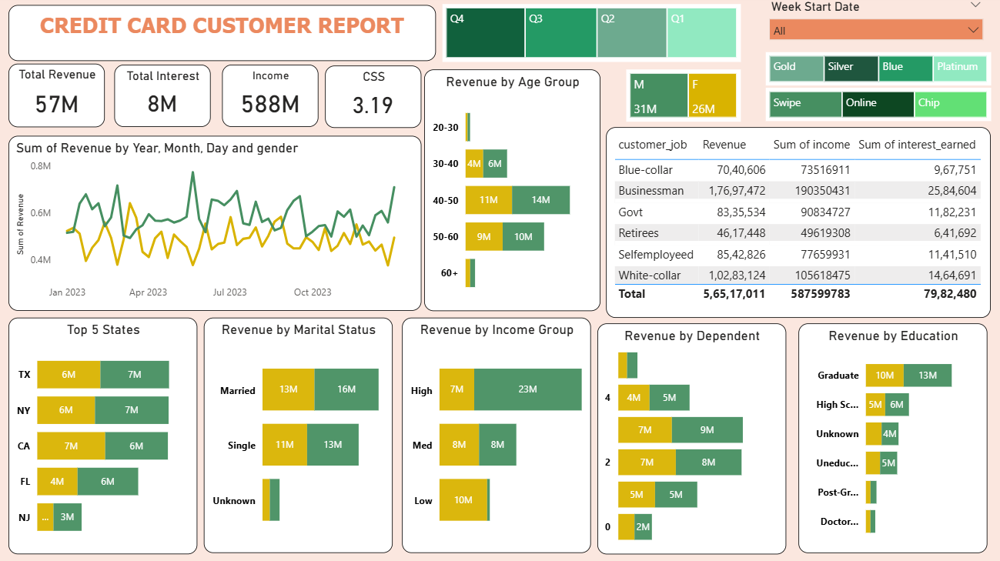
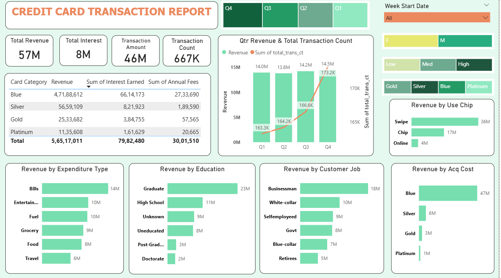

# 💳 Credit Card Financial Dashboard

This repository contains **Power BI dashboards** analyzing **credit card customer and transaction data**.  
It provides real-time insights into **revenue, transactions, customer demographics, and card usage patterns**, helping stakeholders monitor and analyze credit card operations effectively.  

---

## 🎯 Project Objective
To develop a **comprehensive credit card weekly dashboard** that provides **real-time insights into key performance metrics and trends**, enabling stakeholders to monitor and analyze credit card operations effectively.

---

## 🗂️ Data Preparation
Data was imported into a **SQL database** before being visualized in Power BI.

1. **Prepare CSV files**  
   - Data was cleaned and structured into separate CSV files.  

2. **Create Tables in SQL**  
   - Database schema was designed to handle customer, transaction, and revenue data.  

3. **Import CSV files into SQL**  
   - Data was inserted into SQL tables and connected to Power BI for reporting.  

---

## 📊 Dashboards

### 1. Credit Card Customer Report
- Revenue distribution by **age, gender, income, marital status, state, education, and occupation**.  
- Highlights customer segments contributing most to revenue.  

---

### 2. Credit Card Transaction Report
- Analysis of **quarterly transactions, card categories, expenditure types, and transaction modes**.  
- Provides insights into usage trends and acquisition costs.  

---

## 🔎 Key Insights 
- Week-over-Week Revenue increased by **28.8%**  
- Overall revenue: **57M**  
- Total interest: **8M**  
- Total transaction amount: **46M**  
- **Male customers (31M)** contribute slightly more revenue than **female customers (26M)**
- Revenue is highest in the 40–50 age group: **25M**
- **Businessmen (17M)** and **white-collar employees (10M)** are the top revenue drivers 
- **Blue & Silver credit cards** account for **93% of overall transactions**  
- Top states (**TX, NY, CA**) contribute **68% of revenue**  
- Overall **Activation rate: 57.5%**  
- Overall **Delinquent rate: 6.06%**  
  
---

## 🛠️ Tech Stack
- **SQL** – Data storage & preparation  
- **Power BI** – Dashboard development & visualization  
- **Excel / CSV** – Data preprocessing  
- **GitHub** – Version control & sharing  

